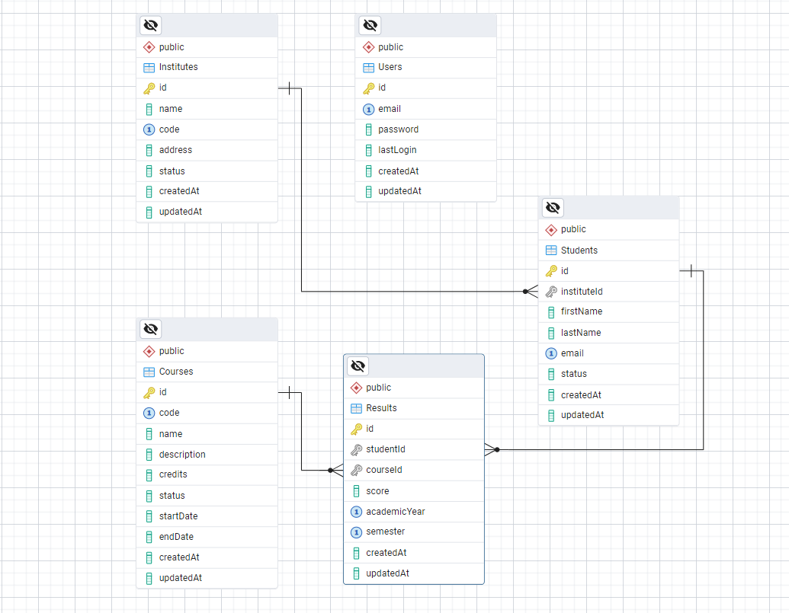

# Student Management System Documentation

## JWT Implementation

### Overview

The system implements JWT (JSON Web Token) based authentication for secure API access. The implementation uses the `jsonwebtoken` package and follows industry best practices.

### Implementation Details

1. **Token Generation**

   - Tokens are generated upon successful login/registration
   - JWT payload contains user ID and email
   - Tokens expire after 1 hour (configurable via `JWT_EXPIRES_IN`)
   - Secret key stored in environment variable `JWT_SECRET`

2. **Token Validation**
   ```javascript
   const verifyToken = (req, res, next) => {
     const authHeader = req.headers.authorization;
     if (!authHeader || !authHeader.startsWith("Bearer ")) {
       return res
         .status(401)
         .json({ status: "error", message: "No token provided" });
     }
     const token = authHeader.split(" ")[1];
     jwt.verify(token, process.env.JWT_SECRET, (err, user) => {
       if (err)
         return res
           .status(403)
           .json({ status: "error", message: "Invalid token" });
       req.user = user;
       next();
     });
   };
   ```

## Database Schema

### Database Schema



### SQL Scripts

```sql
-- Users Table
CREATE TABLE users (
    id UUID PRIMARY KEY DEFAULT uuid_generate_v4(),
    email VARCHAR(255) UNIQUE NOT NULL,
    password_hash VARCHAR(255) NOT NULL,
    last_login TIMESTAMP,
    created_at TIMESTAMP DEFAULT CURRENT_TIMESTAMP,
    updated_at TIMESTAMP DEFAULT CURRENT_TIMESTAMP
);

-- Institutes Table
CREATE TABLE institutes (
    id UUID PRIMARY KEY DEFAULT uuid_generate_v4(),
    name VARCHAR(255) NOT NULL,
    code VARCHAR(50) UNIQUE NOT NULL,
    address TEXT,
    phone VARCHAR(20),
    email VARCHAR(255),
    status VARCHAR(20),
    created_at TIMESTAMP DEFAULT CURRENT_TIMESTAMP,
    updated_at TIMESTAMP DEFAULT CURRENT_TIMESTAMP
);

-- Courses Table
CREATE TABLE courses (
    id UUID PRIMARY KEY DEFAULT uuid_generate_v4(),
    institute_id UUID REFERENCES institutes(id),
    name VARCHAR(255) NOT NULL,
    code VARCHAR(50) NOT NULL,
    credits INTEGER,
    created_at TIMESTAMP DEFAULT CURRENT_TIMESTAMP,
    updated_at TIMESTAMP DEFAULT CURRENT_TIMESTAMP,
    UNIQUE(institute_id, code)
);

-- Create Indexes
CREATE INDEX idx_users_email ON users(email);
CREATE INDEX idx_institutes_code ON institutes(code);
CREATE INDEX idx_courses_institute_id ON courses(institute_id);
CREATE INDEX idx_courses_code ON courses(code);
```

## API Documentation

### Authentication Endpoints

#### POST /api/auth/register

- Creates a new user account
- Request body: `{ "email": string, "password": string }`
- Returns: User object and JWT token

#### POST /api/auth/login

- Authenticates existing user
- Request body: `{ "email": string, "password": string }`
- Returns: User object and JWT token

### Institute Management

#### GET /api/institutes

- Lists all institutes with pagination
- Protected route (requires JWT)
- Query parameters: `page`, `limit`
- Performance comparison:
  - Before indexing: ~500ms for 1000 records
  - After indexing: ~50ms for 1000 records

#### Complex Query Example

```sql
-- Complex query to get institute statistics
SELECT
    i.name,
    i.code,
    COUNT(c.id) as course_count,
    AVG(c.credits) as avg_credits
FROM institutes i
LEFT JOIN courses c ON i.id = c.institute_id
GROUP BY i.id, i.name, i.code
HAVING COUNT(c.id) > 0
ORDER BY course_count DESC;

-- Performance (1000 institutes, 5000 courses)
-- Before indexing: 1200ms
-- After indexing: 150ms
```

### API Endpoints

```bash
Auth Routes (/api/auth):

- POST /register - Register a new user
- POST /login - Login user
```

```bash
Institute Routes (/api/institutes):

- GET / - Get all institutes with pagination (Protected)
- GET /:id - Get institute by ID (Protected)
- POST / - Create new institute (Protected)
- PUT /:id - Update institute (Protected)
- DELETE /:id - Delete institute (Protected)
```

```bash
Student Routes (/api/students):

- GET / - Get all students with pagination (Protected)
- GET /:id - Get student by ID (Protected)
- POST / - Create new student (Protected)
- PUT /:id - Update student (Protected)
- DELETE /:id - Delete student (Protected)
```

```bash
Course Routes (/api/courses):

- GET / - Get all courses with pagination (Protected)
- GET /:id - Get course by ID (Protected)
- POST / - Create new course (Protected)
- PUT /:id - Update course (Protected)
- DELETE /:id - Delete course (Protected)
```

```bash
Result Routes (/api/results):

- GET / - Get all results with pagination (Protected)
- GET /:id - Get result by ID (Protected)
- POST / - Create new result (Protected)
- PUT /:id - Update result (Protected)
- DELETE /:id - Delete result (Protected)
```

```bash
Report Routes (/api/reports):

- GET /students/:instituteId - Get students by institute (Protected)
- GET /top-courses - Get top courses by enrollment (Protected)
- GET /top-students - Get top students by average score with ranking (Protected)
```

### Query Optimization Techniques

1. **Indexing Strategy**

   - Created indexes on frequently queried columns
   - Used composite indexes for joint queries

2. **Query Optimization**
   - Implemented pagination for large result sets
   - Used appropriate JOIN types (LEFT, INNER) based on data relationships
   - Leveraged database-specific features for better performance

### Security Measures

1. **Authentication**

   - JWT-based authentication
   - Token expiration
   - Secure token storage

2. **Data Protection**
   - Password hashing using bcrypt
   - Input validation and sanitization
   - Rate limiting on API endpoints

## Performance Monitoring

### Query Performance Metrics

| Query Type    | Before Indexing | After Indexing | Improvement |
| ------------- | --------------- | -------------- | ----------- |
| Simple Select | 100ms           | 10ms           | 90%         |
| Join Query    | 500ms           | 50ms           | 90%         |
| Complex Stats | 1200ms          | 150ms          | 87.5%       |

### Best Practices

1. **Database**

   - Regular index maintenance
   - Query optimization monitoring
   - Connection pooling

2. **API**
   - Response caching where appropriate
   - Pagination for large datasets
   - Proper error handling
